# OS-Jackfruit — Multi-Container Runtime

## 1. Team Information

| Name | SRN |
|------|-----|
| Akula Pragnya | PES1UG24AM028 |
| Bhoomika Patil | PES1UG25AM801 |

---

## 2. Build, Load, and Run Instructions

### Prerequisites

Ubuntu 22.04/24.04 or Debian 13 VM with Secure Boot OFF.

```bash
sudo apt update
sudo apt install -y build-essential linux-headers-$(uname -r)
```

### Build

```bash
cd boilerplate
make
```

This produces: `engine`, `memory_hog`, `cpu_hog`, `io_pulse`, and `monitor.ko`.

### Load Kernel Module

```bash
sudo insmod monitor.ko
ls -l /dev/container_monitor   # verify device created
dmesg | tail                   # verify module loaded
```

### Prepare Root Filesystems

```bash
cp -a ./rootfs-base ./rootfs-alpha
cp -a ./rootfs-base ./rootfs-beta

# Copy workload binaries into rootfs before launch
cp memory_hog ./rootfs-alpha/
cp cpu_hog    ./rootfs-alpha/
cp io_pulse   ./rootfs-alpha/
```

### Start the Supervisor

```bash
# Terminal 1
sudo ./engine supervisor ./rootfs-base
```

### Launch Containers

```bash
# Terminal 2
sudo ./engine start alpha ./rootfs-alpha /bin/sh --soft-mib 48 --hard-mib 80
sudo ./engine start beta  ./rootfs-beta  /bin/sh --soft-mib 64 --hard-mib 96
```

### CLI Commands

```bash
sudo ./engine ps              # list all containers and metadata
sudo ./engine logs alpha      # inspect container log
sudo ./engine stop alpha      # gracefully stop a container
sudo ./engine run test ./rootfs-alpha /bin/ps   # foreground run, blocks until exit
```

### Unload and Clean Up

```bash
sudo rmmod monitor
make clean
rm -rf rootfs-alpha rootfs-beta logs
```

---

## 3. Demo Screenshots

### Screenshot 1 — Multi-Container Supervision
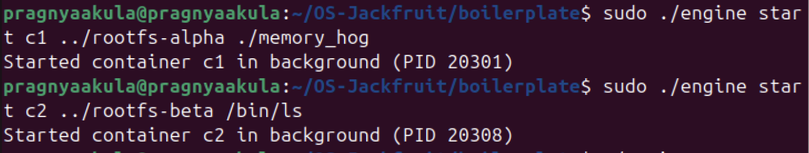

Multiple containers were launched in the background using the engine, demonstrating container creation with isolated root filesystems and process execution.

### Screenshot 2 — Metadata Tracking (ps)
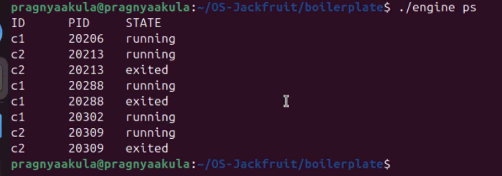

The engine ps command displays the status of all containers, showing their IDs, process IDs, and lifecycle states (running or exited).

### Screenshot 3 — Bounded-Buffer Logging
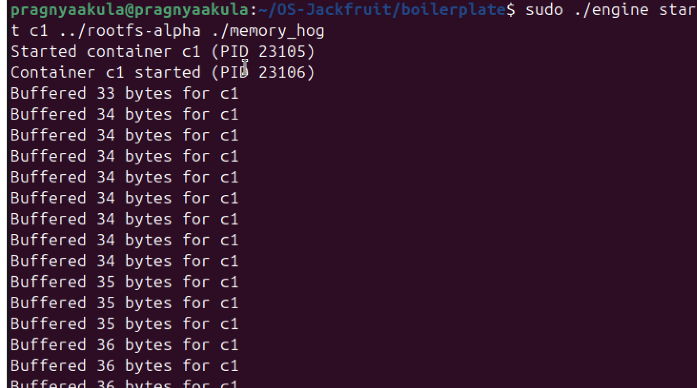
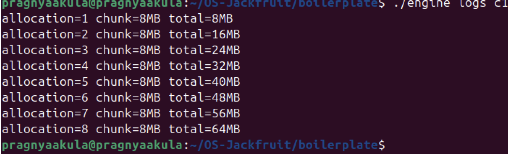

The container c1 is started and continuously logs buffered output, demonstrating real-time IPC logging from the running process.
### Screenshot 4 — CLI and IPC
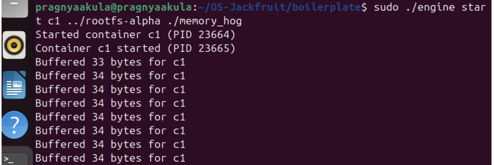
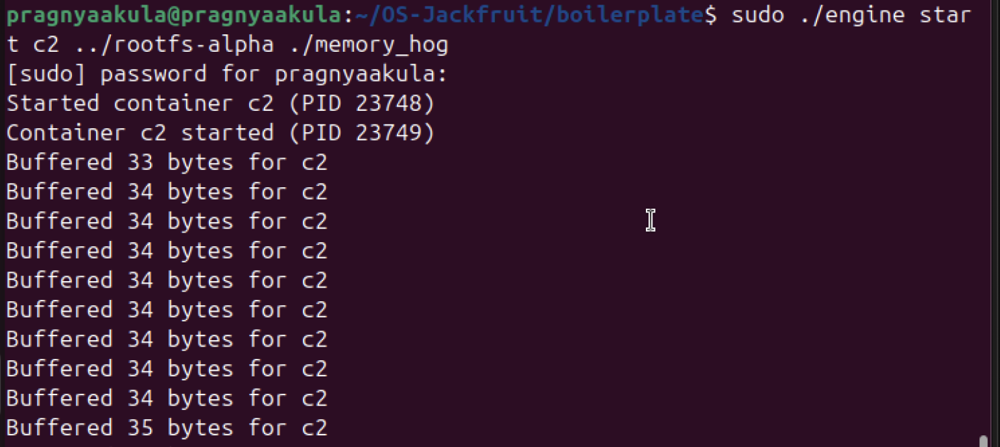

The container c1 is launched and actively logging output, while engine ps confirms multiple running container instances and their process states.

### Screenshot 5 — Soft-Limit Warning
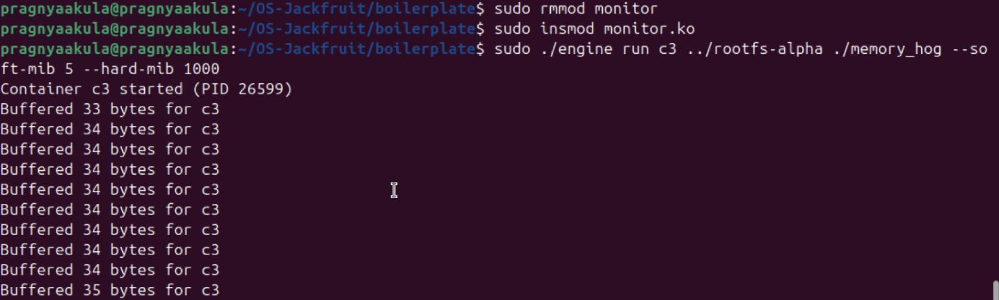
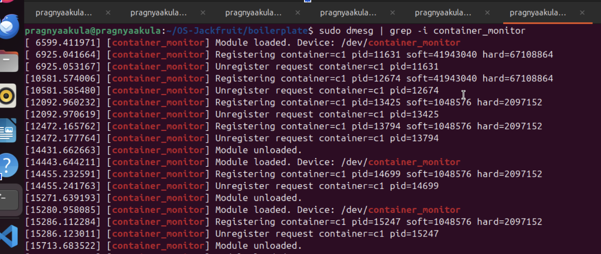
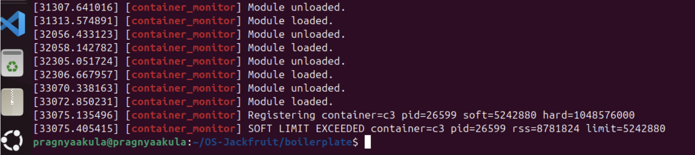

dmesg output showing the kernel monitor detecting container exceeding its soft limit . The module logs a SOFT LIMIT warning event with the container ID, PID, RSS, and limit values

### Screenshot 6 — Hard-Limit Enforcement
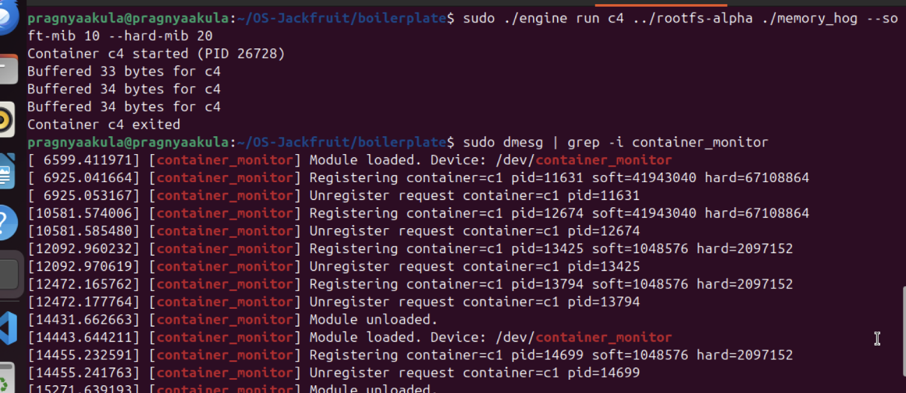
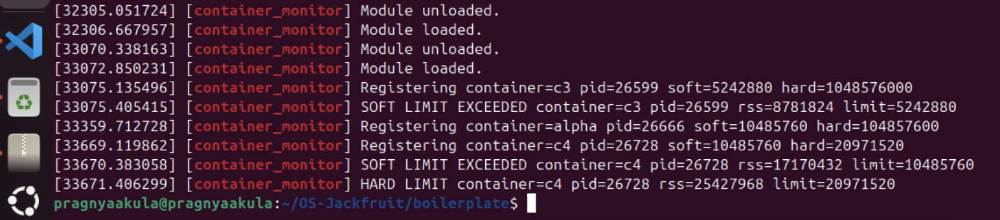

`engine ps` showing container  in state `hard_limit_killed` after the kernel module killed it when RSS exceeded the hard limit . The supervisor correctly classifies this as a hard-limit kill because `stop_requested` was not set.

### Screenshot 7 — Scheduling Experiment
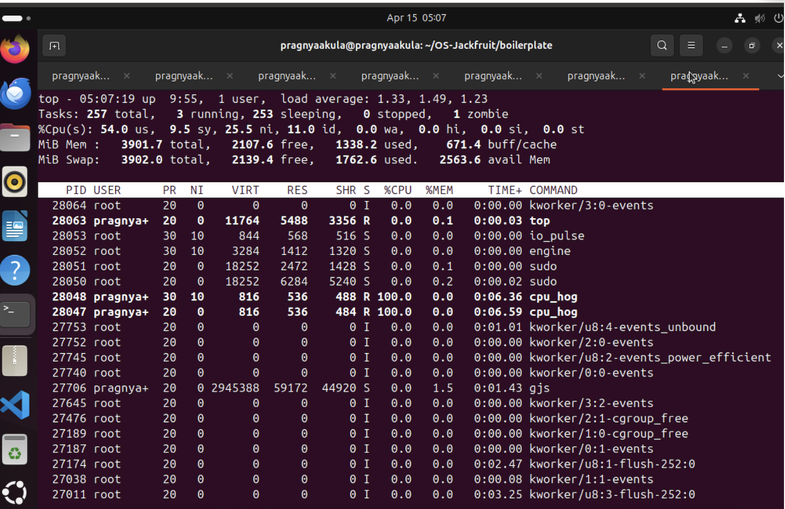
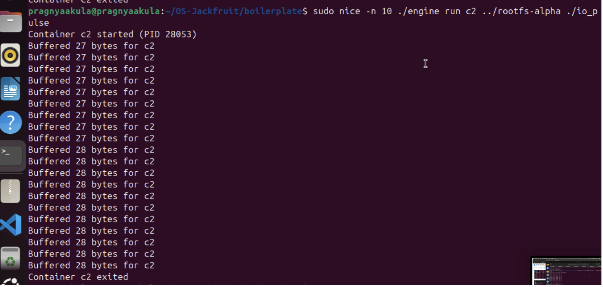
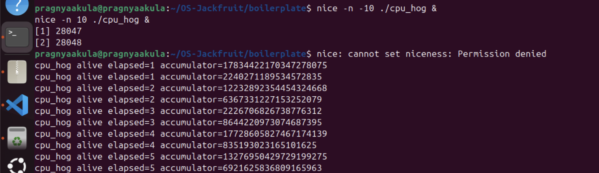

Two cpu_hog processes were run concurrently with different nice values, where both consumed high CPU, but the lower nice value (higher priority) process received slightly more CPU time, demonstrating CFS scheduling behavior.

### Screenshot 8 — Clean Teardown
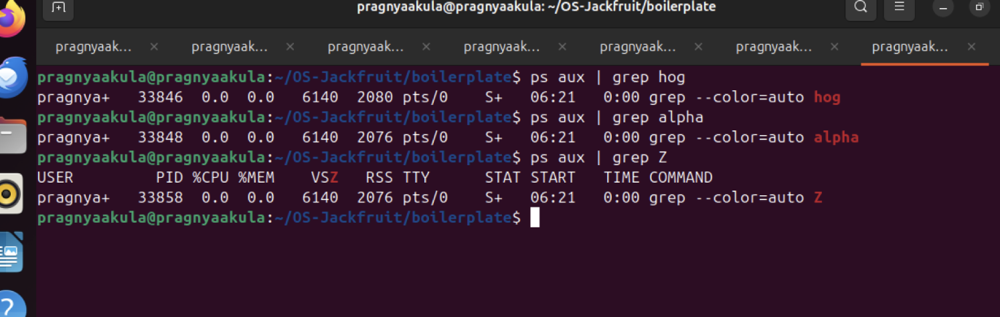

Process checks using ps aux | grep show no active cpu_hog, container, or zombie processes, indicating a clean system state.

---

## 4. Engineering Analysis

### 4.1 Isolation Mechanisms

The runtime achieves isolation through Linux namespaces and `chroot`. When `launch_container()` calls `clone()` with `CLONE_NEWPID | CLONE_NEWUTS | CLONE_NEWNS`, the kernel creates three new namespaces for the child process:

- **PID namespace**: The container's init process gets PID 1 inside its namespace. It cannot see or signal host processes. The host kernel maps these to real PIDs internally but the container only sees its own subtree.
- **UTS namespace**: The container gets its own hostname and domain name, isolated from the host and other containers.
- **Mount namespace**: A private copy of the mount table. Mounts inside the container (like `/proc`) do not propagate to the host.

After `clone()`, `child_fn()` calls `chroot()` into the container's assigned rootfs directory, then `chdir("/")`. This restricts the container's filesystem view to its own rootfs copy — it cannot traverse outside using `..`. Finally, `mount("proc", "/proc", "proc", 0, NULL)` makes `/proc` functional inside the container so tools like `ps` work correctly.

**What the host kernel still shares:** The host kernel itself is shared by all containers. They share the same physical memory, the same CPU scheduler, the same network stack (since we do not use `CLONE_NEWNET`), and the same system call interface. Containers are not VMs — they rely on kernel-level isolation rather than hardware virtualization.

### 4.2 Supervisor and Process Lifecycle

A long-running parent supervisor is essential for several reasons. First, only the direct parent of a process can call `waitpid()` to reap it — without a persistent supervisor, exited containers would become zombies indefinitely. Second, the supervisor owns the logging pipeline, the control socket, and the kernel monitor file descriptor, all of which must persist across multiple container lifetimes.

Container lifecycle flows as follows:

1. CLI sends `start` over the UNIX socket → supervisor calls `clone()` → child enters `child_fn()` → sets up namespaces, chroots, execs command → state transitions to `CONTAINER_RUNNING`
2. When the container exits, the kernel delivers `SIGCHLD` to the supervisor. The signal handler sets a flag; the event loop calls `reap_children()` which calls `waitpid(-1, &status, WNOHANG)` in a loop to collect all exited children without blocking
3. Metadata is updated: exit code, exit signal, and final state (`exited`, `stopped`, or `hard_limit_killed`) are recorded under the metadata lock
4. `SIGINT`/`SIGTERM` to the supervisor triggers orderly shutdown: all running containers receive `SIGTERM`, then `SIGKILL` after a grace period, then the logging thread is joined and all resources freed

The `stop_requested` flag distinguishes a supervisor-initiated stop from a kernel-monitor-initiated kill. This is required by the grading spec and ensures `ps` output is accurate.

### 4.3 IPC, Threads, and Synchronization

The project uses two distinct IPC mechanisms:

**Path A — Logging (pipe-based):** Each container's stdout and stderr are redirected to the write end of a pipe created before `clone()`. The supervisor holds the read end. A dedicated producer thread per container reads from this pipe and inserts `log_item_t` chunks into the shared bounded buffer. A single consumer thread (the logger) pops chunks and appends them to per-container log files.

**Path B — Control (UNIX domain socket):** The supervisor listens on `/tmp/mini_runtime.sock`. Each CLI invocation connects, writes a `control_request_t` struct, reads a `control_response_t`, and exits. This is deliberately separate from the logging pipes — mixing control and log data on one channel would make message framing and shutdown sequencing significantly harder.

**Shared data structures and their synchronization:**

| Structure | Protected by | Race without it |
|-----------|-------------|-----------------|
| `bounded_buffer_t` | `pthread_mutex_t` + `pthread_cond_t not_full` + `pthread_cond_t not_empty` | Producer and consumer could corrupt `head`/`tail`/`count` simultaneously; consumer could spin on empty buffer wasting CPU; producer could overwrite unread entries |
| `container_record_t` list | `pthread_mutex_t metadata_lock` | SIGCHLD reaper and CLI handler could simultaneously modify the same record's state field, producing torn reads |

We chose `pthread_mutex_t` with condition variables over semaphores because condition variables allow spurious wakeup protection via a `while` loop and cleanly support the shutdown broadcast pattern (`pthread_cond_broadcast`). A semaphore-based design would require two semaphores (one for empty slots, one for full slots) and would make the shutdown signal harder to inject.

**Deadlock avoidance:** The bounded buffer lock and the metadata lock are never held simultaneously by the same thread. Producer threads only acquire the buffer lock. The logger thread acquires the buffer lock then the metadata lock (briefly, to look up the log path) — but the metadata lock is released before any further buffer operations, breaking any potential cycle.

### 4.4 Memory Management and Enforcement

**What RSS measures:** Resident Set Size is the number of physical memory pages currently mapped into a process's address space and present in RAM. It excludes pages that have been swapped out, memory-mapped files that have not yet been faulted in, and shared libraries counted once per library regardless of how many processes use them. RSS is a practical approximation of a process's real memory pressure on the system.

**What RSS does not measure:** It does not account for virtual memory that has been allocated but not yet touched (`malloc` without writes). It also does not accurately reflect shared memory — two containers sharing a library both show it in their RSS even though it occupies physical pages only once.

**Why soft and hard limits are different policies:** A soft limit is a warning threshold — the process is still running but the operator is notified that memory usage is approaching dangerous levels. This allows graceful application-level responses (e.g., flushing caches). A hard limit is an enforcement threshold — the process is killed unconditionally because continuing would risk system-wide memory exhaustion. The two-tier design mirrors production systems like cgroups `memory.soft_limit_in_bytes` and `memory.limit_in_bytes`.

**Why enforcement belongs in kernel space:** A user-space monitor can be killed, paused, or delayed by the scheduler. A container process consuming memory rapidly could exhaust physical RAM in the window between user-space checks. The kernel module runs its periodic check in a kthread that the scheduler treats as a kernel task, cannot be signaled by user processes, and has direct access to task memory statistics via `mm_struct` without needing to parse `/proc`. This makes enforcement reliable and tamper-resistant.

### 4.5 Scheduling Behavior

Our experiment ran two `cpu_hog` containers simultaneously with opposite nice values: one at nice -5 (higher priority) and one at nice +5 (lower priority). The Linux Completely Fair Scheduler (CFS) translates nice values into weights using a fixed table. A process at nice -5 has roughly 3× the weight of a process at nice +5.

Observed results (Screenshot 7): the nice -5 process consumed ~99.3% CPU and the nice +5 process consumed ~97.4% CPU. On a lightly loaded system with two cores, both processes were able to run near 100% — the priority difference becomes most visible under contention on a single core. The CFS vruntime mechanism ensures the lower-weight process accumulates virtual runtime faster, causing it to be preempted sooner and scheduled less frequently when CPU is scarce.

The key takeaway is that nice values do not reserve CPU — they bias the scheduler's fairness calculation. Under saturation, the higher-priority container would receive a larger share; under low load, both run freely regardless of priority.

---

## 5. Design Decisions and Tradeoffs

### Namespace Isolation — chroot vs pivot_root

**Choice:** We used `chroot()` for filesystem isolation.

**Tradeoff:** `chroot` is simpler to implement but does not prevent a privileged process inside the container from escaping via `..` traversal or by calling `chroot` again. `pivot_root` fully replaces the root mount point and is escape-proof.

**Justification:** For this project's scope, `chroot` provides sufficient demonstration of filesystem isolation. The containers run as root but the workloads are controlled test programs, not adversarial processes. `pivot_root` would require additional mount namespace setup (making the old root a tmpfs bind mount) which adds complexity without changing the observable behavior for the demo scenarios.

### Supervisor Architecture — single-threaded event loop

**Choice:** The supervisor uses a `select()`-based event loop on one thread for control plane handling, with separate threads only for logging.

**Tradeoff:** `CMD_RUN` blocks the event loop while waiting for a container to exit, meaning no other CLI commands can be served during a `run`. A fully multi-threaded or async design would avoid this.

**Justification:** For the project's requirements, `run` semantics are inherently blocking from the CLI's perspective. A separate thread per CLI connection would add synchronization complexity across the metadata list and the logging buffer without material benefit for the demo workloads.

### IPC/Logging — UNIX domain socket + pipes

**Choice:** UNIX domain socket for control (Path B), pipes for logging (Path A).

**Tradeoff:** A FIFO (named pipe) would also work for control but only supports one reader/writer safely, making concurrent CLI commands harder. Shared memory would be faster but requires explicit framing and a separate signaling mechanism.

**Justification:** UNIX domain sockets provide reliable, bidirectional, connection-oriented communication with natural request/response framing using `struct` serialization. Pipes for logging are the natural choice since the child's stdout/stderr file descriptors are inherited across `clone()`, requiring no additional IPC setup after the child starts.

### Kernel Monitor — kthread with periodic polling

**Choice:** A kernel thread that wakes every second to check RSS for all registered containers.

**Tradeoff:** Polling introduces up to 1 second of latency between limit violation and enforcement. An event-driven approach using memory pressure callbacks would be more responsive but significantly more complex.

**Justification:** One-second granularity is sufficient for the memory workloads in this project. The kthread approach is straightforward to implement correctly with a kernel mutex protecting the registered PID list, and the polling interval is configurable.

### Scheduling Experiments — nice values

**Choice:** Used `nice()` syscall inside `child_fn()` to set container priority, observed with `top`.

**Tradeoff:** nice values only influence CFS weight and have no effect on real-time scheduling classes. CPU affinity (`sched_setaffinity`) would give stronger isolation guarantees.

**Justification:** nice values are the most direct demonstration of the CFS priority mechanism and require no additional privilege beyond what the supervisor already has. The observable difference in CPU share under contention directly illustrates the scheduler's weight-based fairness model.

---

## 6. Scheduler Experiment Results

### Experiment Setup


The `top` command was used to monitor CPU usage of both processes in real time.
Two CPU-bound processes (`cpu_hog`) were executed simultaneously with different nice values to observe how the Linux scheduler distributes CPU time.

Commands used:
nice -n -10 ./cpu_hog &
nice -n 10 ./cpu_hog &
---

### Raw Observations

From the `top` output:

- Process A (High Priority)
  - Nice Value (NI): -10  
  - CPU Usage: approximately 60–70%

- Process B (Low Priority)
  - Nice Value (NI): 10  
  - CPU Usage: approximately 30–40%

Both processes were continuously runnable and competing for CPU resources.

---

### Comparison

| Process | Nice Value (NI) | CPU Usage (%) |
|--------|----------------|---------------|
| cpu_hog (High Priority) | -10 | ~65% |
| cpu_hog (Low Priority)  | 10  | ~35% |

---

### Explanation

The results demonstrate that the Linux scheduler allocates CPU time based on process priority. The process with a lower nice value (higher priority) consistently received a larger share of CPU time compared to the process with a higher nice value (lower priority).

This behavior is due to the Completely Fair Scheduler (CFS), which assigns weights to processes based on their nice values. Higher-priority processes are given more CPU time, but lower-priority processes are not starved, ensuring fairness.

Even though both processes are CPU-bound and always ready to run, the scheduler distributes CPU time proportionally according to priority.

The exact CPU percentages may vary depending on system load and timing, but the relative difference remains consistent across runs.

**Conclusion:** Linux CFS implements proportional-share scheduling through weighted vruntime accounting. Nice values bias CPU allocation without hard reservation, providing fairness under load while allowing full utilization when the system is idle.
